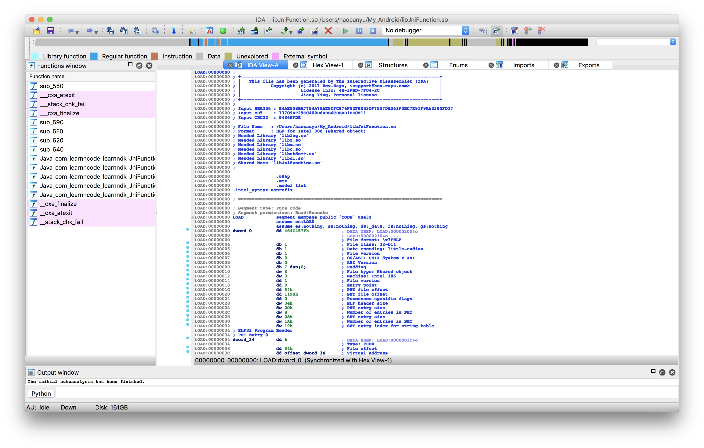
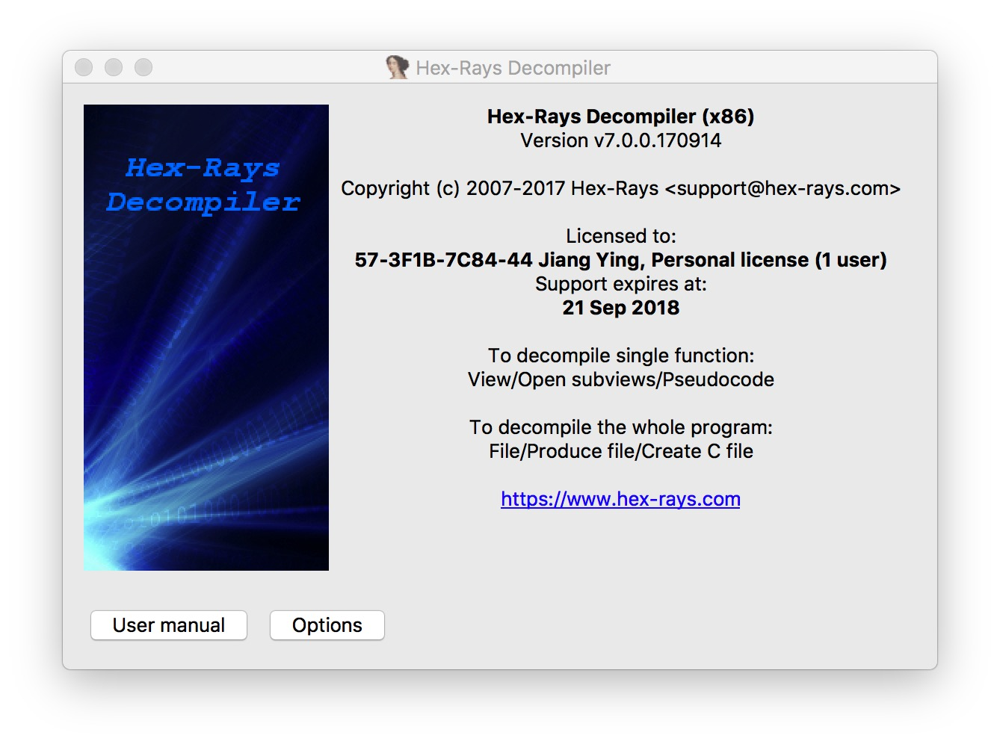
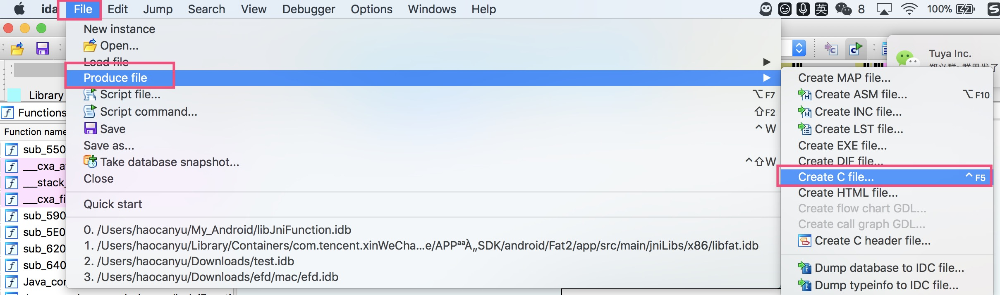
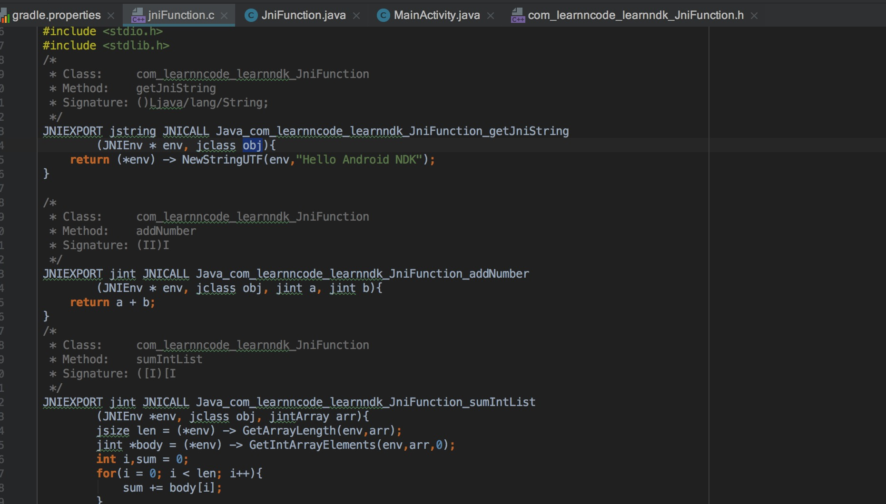

# 做个小偷
在Android项目中有时会用到so库，还想知道so里面具体的逻辑代码。这时候就需要一个反编译工具去满足我们贪婪的欲望。使用IDA可以满足这个需要。
# IDA Pro使用
> 这里使用的是Mac V7版本 

* 打开IDA Pro软件
* 将需要反编译的so文件拖入工程      
打开之后可以看到so文件反编译后看到的页面如下

IDA View-A呈现的是对应汇编代码；Function Window是各个函数方法；Hex View是展示的是机器码。
* 反编译成c文件需要用到hex-ray插件     

> 很多教程说使用F5就能反编译出c文件，但我好像没有成功过。

生成c文件成功后就能看到源码内容了

对比原来Android项目中写的c文件

# 附件

# 参考资料
* https://blog.csdn.net/lanyang123456/article/details/56497264
* https://blog.csdn.net/pengyan0812/article/details/43988171
* http://www.woodmann.com/crackz/Tutorials/Flores1.htm 
* https://pan.baidu.com/s/1pLv9hov#list/path=%2F579910%20IDA_Pro_7_Mac
* https://www.cnblogs.com/suliang-com/p/6866435.html        (Android项目中c文件生成so文件)
