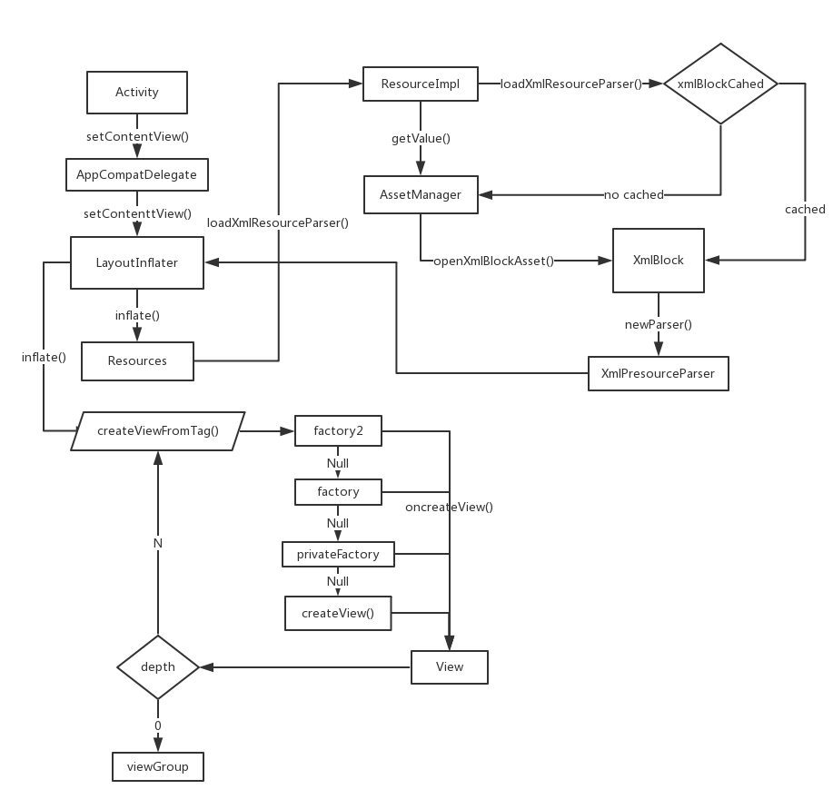

# 开始前
上周在github上看到关于提升Android布局加载速度的开源库[X2C](https://github.com/iReaderAndroid/X2C)。对于Android开发设置布局不外乎于两种方式：xml、Java编码。过去有段时间我也尝试着抛弃xml直接使用代码去创建布局，但问题在于代码创建的布局无法实时查看、布局过于复杂用代码实现不太容易等缺点。X2C开源库的功能大致上是通过编写xml文件产出代码文件，最终通过java代码编写UI布局。
# 两种布局实现方式的不同
虽然我们平常在Android开发中常常适用xml文件编写UI布局，那为何不使用易用可视化的xml布局实现方式而采用代码方式实现呢。其实xml方式的UI布局多一层对xml文件的读取和解析将xml文件中的各种UI控件最终实例化成Java代码控件，所以最终还是回到以Java代码实现布局的步骤，因此为什么说Java代码实现布局会比xml加载效率更高了，其大体上我们可以通过Android源码探一探究竟。
# 布局加载方式
这里主要拿Activity的布局加载作为例子。之前提到过布局加载方法setContentView提供两种方式提供xml文件的资源ID加载xml文件，另外一种是View对象。
当前sdk版本中会根据BuildSdk版本不同创建不同的适配AppCompatDelegate对象，但这里要讲的创建布局还是在AppCompatDelegateImplV9中实现并未做重写操作。UI布局加载View对象的方式这里不多加以解析，只是通过contentParent将需要呈现的UI布局通过addView方法实现。下面还是主要看看加载xml文件具体是如何实现加载布局的。

## xml文件加载方式
xml文件是由LayoutInflater加载,LayoutInflater是一个抽象类通过from获取context，然后方法inflate载入resId和contentParent。
1. Resources    
然后通过Resources对象的getLayout方法获取到XmlResourceParser。getLayout通过loadXmlResourceParser加载layout资源，其中在ResourcesImpl得到TypedValue，然后调用ResourcesImpl的loadXmlResourceParser判断是从xml缓存区cachedXmlBlocks中得到XmlResourceParser还是重新创建XmlResourceParser结果。
2. AssetManager 
通过AssetManager的getResourceValue调用native层级loadResourceValue方法实例化TypedValue，若在Resources中未能找到当前布局的xml缓存则通过native层级openXmlBlockAsset创建XmlBlock对象。XmlBlock调用newParser方法获取到XmlResourceParser对象。
3. LayoutInflater   
获取到XmlResourceParser之后调用inflate方法。其中关键创建布局DOM代码在rInflate方法，方法内部while循环以及递归操作。除去上层逻辑判断异常处理部分代码后，重心关注最后View的创建和布局拼接组合。通过createViewFromTag创建View对象然后通过addView将实例化的布局控件装载到ViewGroup（Parent）。那创建View的过程是代码片是通过好几种方式找到正确的创建View方法而创建的，大致可以分为Factory2、Factory、privateFactory以及LayoutInflater的createView方法。就近原则先看看createView方法的代码会发现View的创建是通过反射方式获取View最终newInstance实例化。而以上Factory2、Factory、privateFactory方式也大同小异都是通过反射创建View。

图1-xml加载布局大致过程

# 最后
加载xml形式的setContentView内部通过反射创建布局确实不比直接用代码创建布局来得高效。每种方式总会存在好与不好的情况，选择哪种形式去实现最终还是由开发者自行斟酌选择最佳方案。最后除了原生方式实现布局创建其实还存在其他更多样化的编写布局方式，例如：Mist、facebook的litho。听说litho加载布局方式可能会更好更高效，但也待进一步证实和调研。