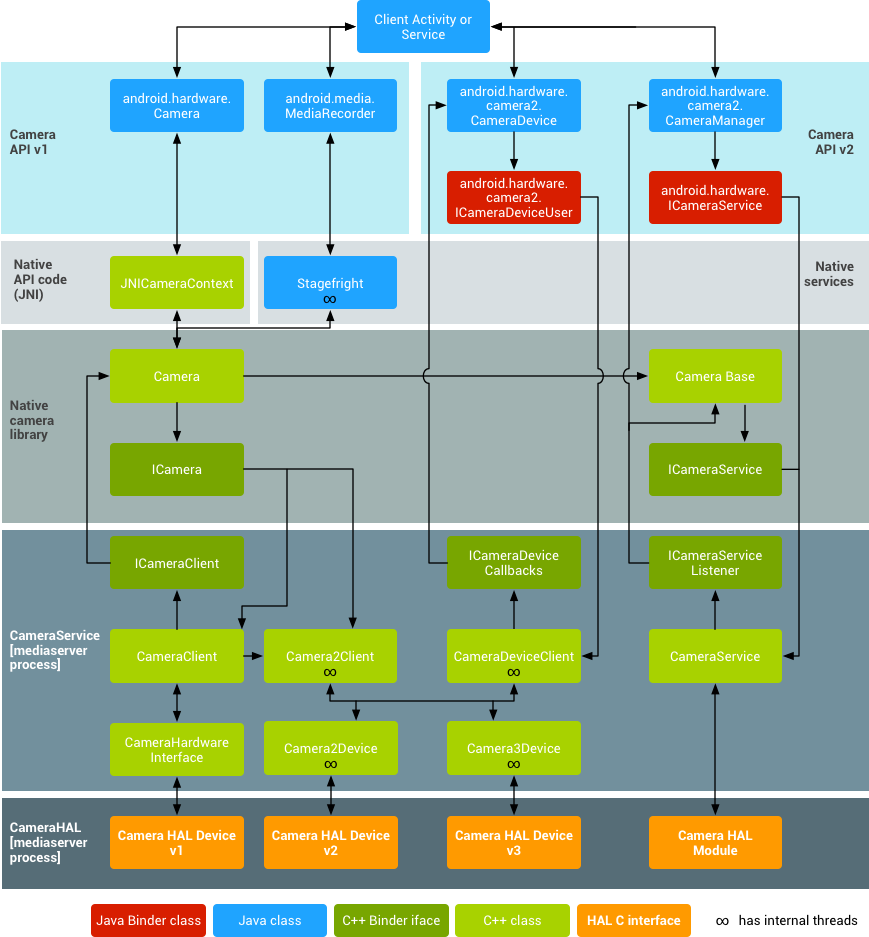

# Android相机开发之架构（二）
第一篇相机介绍了Android平台Camera1和Camera2的开发使用。这篇文章来看看Camera1和Camera2在架构上的不同。
## 新旧Camera的对比

谷歌官网上的Camera架构图，对比了Camera1和Camera2组件架构和HAL实现过程。
### Camera1架构
第一篇已经介绍过Camera1是通过Camera类简单实现，其中一些方法是直接调用JNI接口获取Camera功能。可以在架构图了解Camera1是通过Native API接口作为与CameraService通信的桥梁。
### Camera2架构
Camera2的实现就不同许多，和Camera1不同的是没有调用Native API接口而是通过CameraDevice和CameraManager使用JavaBinder接口与CameraService通信。

## 参考
- https://source.android.com/devices/camera