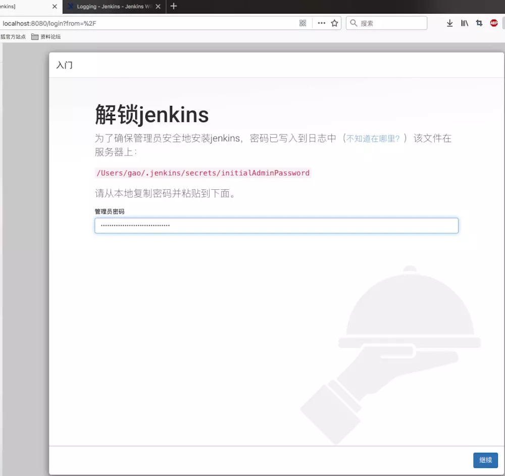
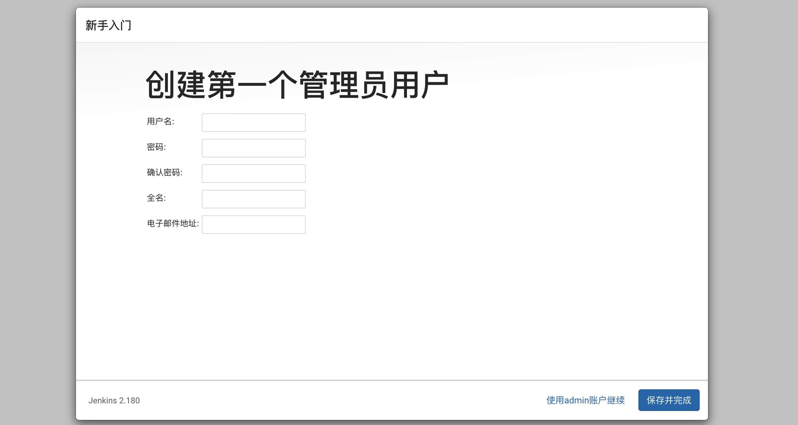
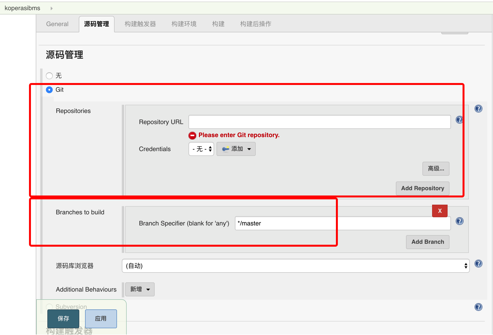

# Jenkins
## Install
安装jenkins
```
brew install jenkins 
```
如果出现以下提示表示需要下载Java,那就按照tip执行brew cask install homebrew/cask-versions/adoptopenjdk8。下载时间有点久的话需要耐心等待
>jenkins: Java 1.8 is required to install this formula.
Install AdoptOpenJDK 8 with Homebrew Cask:
  brew cask install homebrew/cask-versions/adoptopenjdk8

又出现奇葩的错误

>Error: Cask adoptopenjdk8 exists in multiple taps:
  homebrew/cask-versions/adoptopenjdk8
  caskroom/versions/adoptopenjdk8

执行删除操作
```
rm /usr/local/Homebrew/Library/Taps/homebrew/homebrew-cask-versions/Casks/adoptopenjdk8.rb

```
启动jenkins服务
```
brew services start jenkins 
```
启动后在浏览器中输出jenkins服务地址http://localhost:8080等待服务开启。
根据提示路径
/Users/yuhaocan/.jenkins/secrets/initialAdminPassword打开文件找到初始化管理员密码。然后在输入密码后安装推荐插件。


接着创建管理员账号密码，正式进入jenkins管理页面。



## Android Setting
进入系统设置进行全局工具配置

配置Java SDK，查找本地javaLibrary路径
```
/usr/libexec/java_home -V
```
gradle路径
```
/Users/yuhaocan/.gradle/wrapper/dists/gradle-4.6-all/bcst21l2brirad8k2ben1letg/gradle-4.6
```
git路径
查找git安装路径
```
which git
```
android_home路径也需要添加


创建Android构建项目，这里依赖的是git仓库。配置git的基本参数和访问账号然后选取gradle构建版本和构建脚本命令算是简单完成了创建工作。


通过buildNow进行应用打包工作

打包日志可以通过控制台输出查看


## Other
* https://www.jianshu.com/p/d76c9fd8dac5
* https://www.cnblogs.com/huanjoyous/p/10435361.html
* https://jenkins.io/zh/