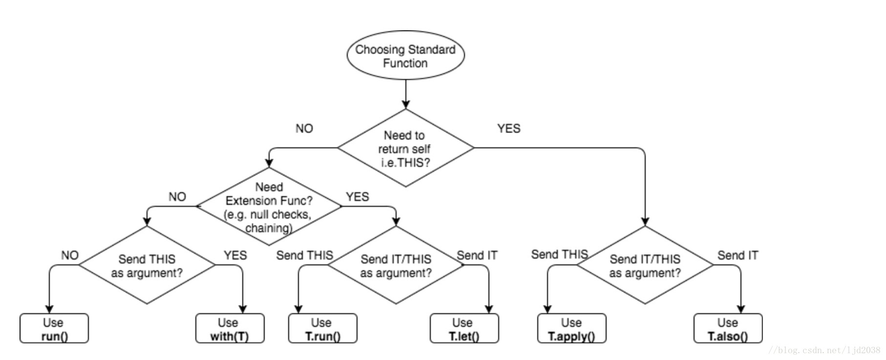

# Kotlin
记录一些kotlin语法特性的东西，掌握kotlin奇妙之处。
## 集合
### 类型别名
typealias
```
typealias Username = String

fun validate(name: Username) {
    if(name.length < 5) {
        println("Username $name is too short.")
    }
}
```
### 内联类
inline
还没有搞清楚内联类的不同之处
* https://blog.csdn.net/u013064109/article/details/84866092
* https://typealias.com/guides/enable-inline-classes-early-access/
内联类实际上是基础类型的包装器,使用基础值时是需要做拆箱处理。内联类为你提供类型的安全性，类型别名则没有。
```
inline class Username(val value: String)

fun validate(name: Username) {
    if (name.value.length < 5) {
        println("Username ${name.value} is too short.")
    }
}
```
### 委托
设计模式中有委托模式，可以说是继承另一种实现方式。koltin原生就支持委托设计模式,如以下例子直接通过对象 Base by b实现对委托的支持。
```
interface Base {
    fun print()
}

class BaseImpl(val x: Int) : Base {
    override fun print() { print(x) }
}

class Derived(b: Base) : Base by b

fun main() {
    val b = BaseImpl(10)
    Derived(b).print()
}
```

### 委托属性* 

## 其他

### 空安全

```
var a : Int ?= null //可空表达
var b : Int = 3 //非空表达
val len = str?.length ?: 0 //Elvis
val len = str!!.length //NPE表达
```

### 作用域
run、let、also、apply、run、with、takeIf、takeUnless

- run
目前对于这个run函数看起来貌似没有什么用处，但是在run函数当中它不仅仅只是一个作用域，他还有一个返回值。他会返回在这个作用域当中的最后一个对象
```
run {
 if (islogin) loginDialog else getAwardDialog
}.show()
```
- with
with也是存在一个返回值，它也是会返回在这个作用域当中的最后一个对象。相比较run会比with更好用可进行判空处理
```
with(webView.settings){
 javaScriptEnabled = true
 databaseEnabled = true
}
webView.settings.run { 
 javaScriptEnabled = true
 databaseEnabled = true
}
```
- let
run通过this获取作用域对象，而let是通过it获取作用域对象，并且它返回的是作用域最后一个对象。实话说let和run好像没有太大区别。
- also
let返回的是作用域中的最后一个对象，它的值和类型都可以改变。但also不管调用多少次返回的都是原来的original对象
- apply
```
fun createIntent(intentData: String, intentAction: String) =
        Intent().apply { action = intentAction }
                .apply { data = Uri.parse(intentData) }
```

#### 这几种作用域区别
对于with,T.run,T.apply接收者是this，而T.let和T.also接受者是it；对于with,T.run,T.let返回值是作用域的最后一个对象（this）,而T.apply和T.also返回值是调用者本身(itself)。



## singleton
koltin创建单例特别简单，object就能创建单例对象,并且是线程安全的
```
object Resource {
    val name = "Name"
}
```
还有另外lazy的单例对象实现
```
class Singleton private constructor() {
    companion object {
        val instance: Singleton by lazy { Singleton() }
    }
}
```
两者略有不同，在单例开销较大时lazy加载更为合适，若内存占用小可以使用object

## IO
kotlin的读写操作和Java存在很大不同，并且在Java代码转Kotlin时经常会出现错误
```
val stream = Files.newInputStream(Paths.get("/some/file.txt"))
stream.buffered().reader().use { reader ->
    println(reader.readText())
}
```

## 伴生对象
与 Java 或 C# 不同，在 Kotlin 中类没有静态方法。在大多数情况下，它建议简单地使用包级函数
类内部的对象声明可以用 companion 关键字标记。可以理解为Java中static静态表达的一种方式。


## 扩展
直接在类的基础上扩展函数和属性，当然这样的扩展不会影响实际类的定义。
```
fun BaseActivity.showToast(cxt: Context,text: String,duration: Int = Toast.LENGTH_SHORT){
    Toast.makeText(cxt,text,duration).show()
}
fun BaseActivity.go(intent: Intent,requestCode: Int = -1){
    if(requestCode == -1){
        startActivity(intent)
    }else{
        startActivityForResult(intent,requestCode)
    }
}
val <T> List<T>.lastIndex: Int
    get() = size - 1
```


